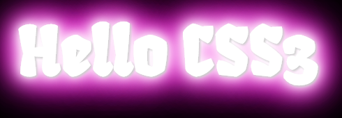

# 最终效果图


设置自的颜色、字号之后的最初效果。


# 设置样式
## 设置字体
`font-family: 'Fruktur', cursive;`


## 为文字添加阴影。
[text-shadow](http://www.w3school.com.cn/cssref/pr_text-shadow.asp)
```css
h1 {
    text-shadow: 1px  1px 1px #ccc,
    0 0 10px #fff,
    0 0 20px #fff,
    0 0 30px #fff,
    0 0 40px #ff00de,
    0 0 70px #ff00de,
    0 0 80px #ff00de,
    0 0 100px #ff00de,
    0 0 150px #ff00de;
}
```


# 定义动画
[animation](http://www.w3school.com.cn/cssref/pr_animation.asp)
`animation` 的语法：
```
animation: name duration timing-function delay iteration-count direction;
```

```css
h1 {
    animation: run  ease-in-out 9s infinite;
}
```
- `run` 是 [animation-name](http://www.w3school.com.cn/cssref/pr_animation-name.asp)，指定动画名称。
- `ease-in-out` 是 [animation-timing-function](http://www.w3school.com.cn/cssref/pr_animation-timing-function.asp)`，指定动画速度曲线。
- `infinite` 是 [animation-iteration-count](http://www.w3school.com.cn/cssref/pr_animation-iteration-count.asp)，循环动画。
- `9s` 是 [animation-duration](http://www.w3school.com.cn/cssref/pr_animation-duration.asp)，执行一次动画的时间是 9s。

## 实现动画
- [@keyframes](http://www.w3school.com.cn/cssref/pr_keyframes.asp)
- [transform](http://www.w3school.com.cn/cssref/pr_transform.asp)
```css
@keyframes run {
    0% {
        transform:rotateX(-5deg) rotateY(0);
    }
    50% {
        transform:rotateX(0) rotateY(180deg);
        text-shadow: 1px  1px 1px #ccc,
        0 0 10px #fff,
        0 0 20px #fff,
        0 0 30px #fff,
        0 0 40px #3EFF3E,
        0 0 70px #3EFFff,
        0 0 80px #3EFFff,
        0 0 100px #3EFFee,
        0 0 150px #3EFFee;

    }
    100% {
        transform:rotateX(5deg) rotateY(360deg);
    }
}
```

## 使子元素保留其3D位置
[transform-style](http://www.w3school.com.cn/cssref/pr_transform-style.asp)
```css
h1 {
    transform-style: preserve-3d;
}
```
